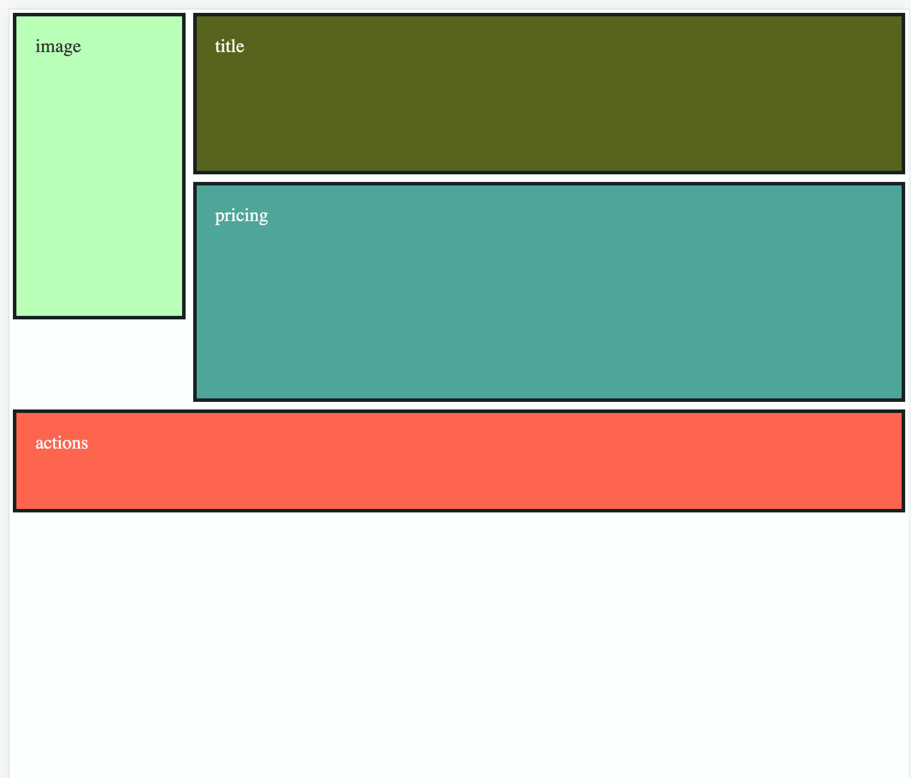
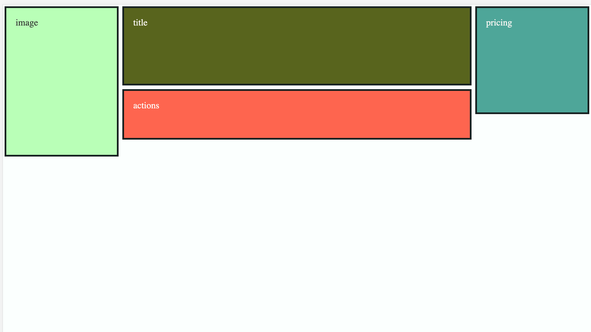

# Musical Chairs

A CSS grid demo showing how to rearrange containers to accommodate a large action row for buttons on small screens.

## Getting Started

Try out the demo on [CodeSandbox](https://codesandbox.io/p/github/jocmp/musical-chairs/main?file=%2FREADME.md)

Or run it locally:

1. Clone this repo
2. Install the dependencies
   ```
   npm install
   ```
3. Run the server
   ```
   npm run start
   ```
4. Open your browser and navigate to http://localhost:3000

## Cast of Characters

- Mint box ................. Playing the part of an Image
- Olive box ................. Playing the part of Title
- Coral box ................. Playing the part of Actions
- Blue box ................. Playing the part of Pricing

## Demo

<table>
<tr>
<td><strong>Mobile</strong></td>
<td valign="top">
  
</td>
</tr>
<tr>
<td><strong>Desktop</strong></td>
<td valign="top">

</td>
</tr>
</table>
